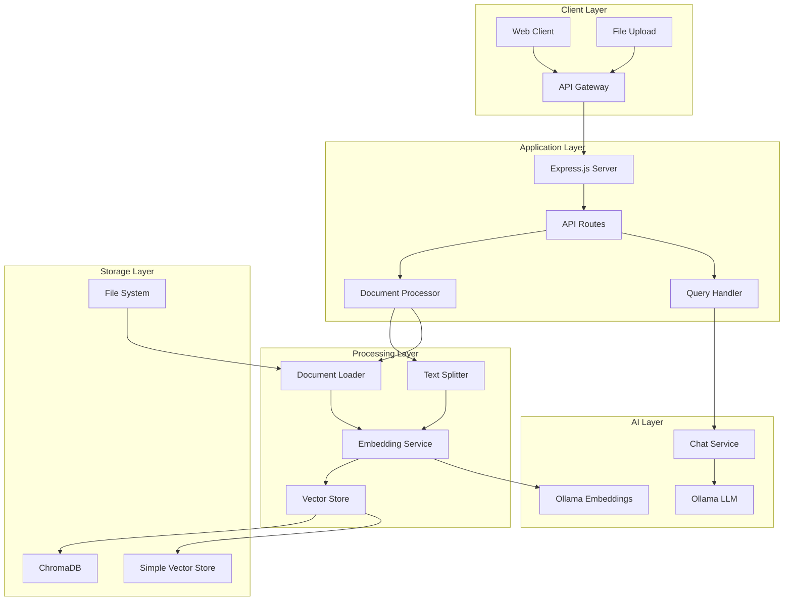
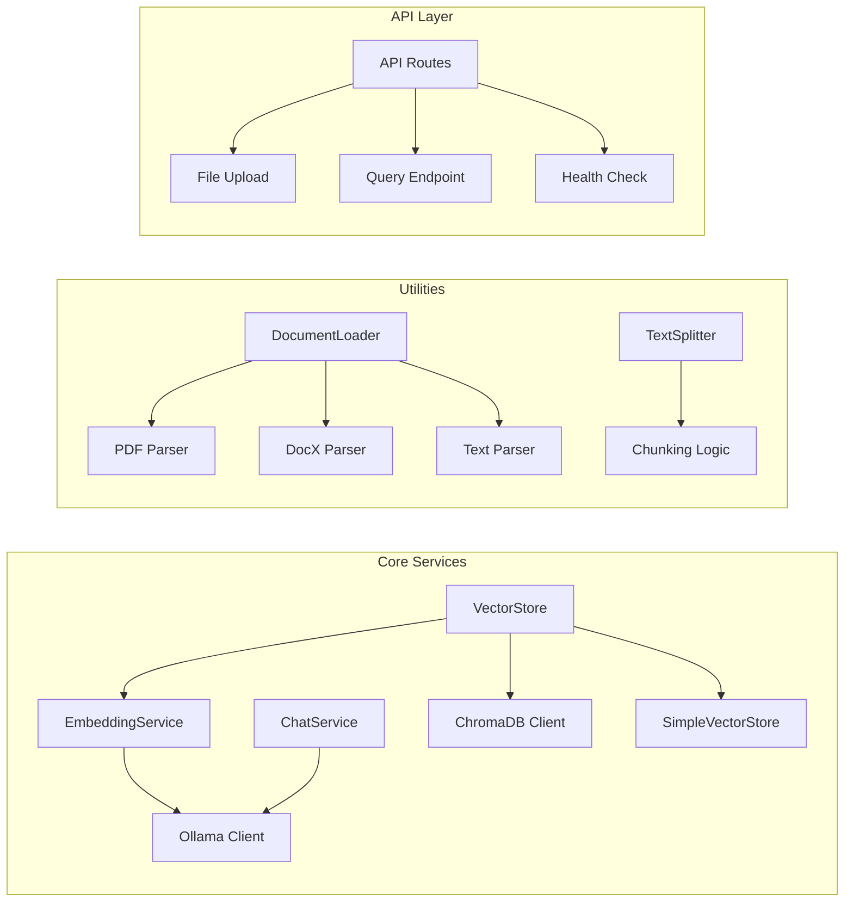
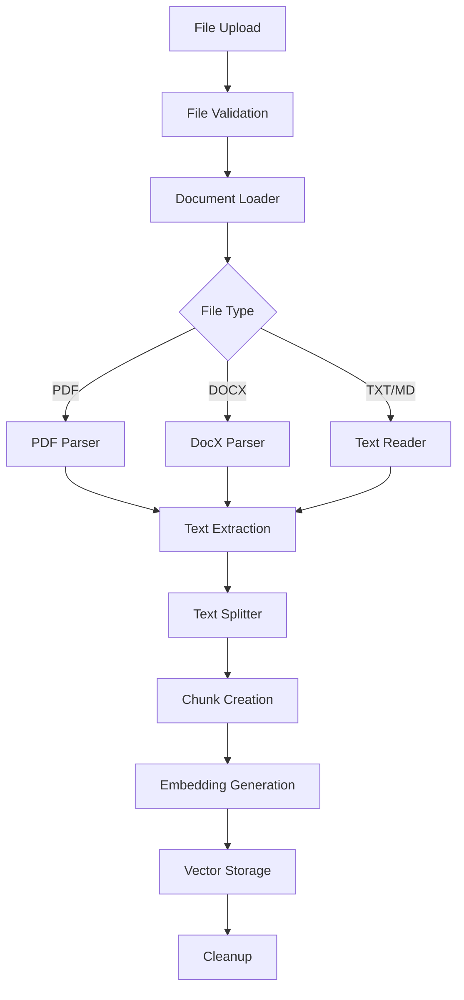
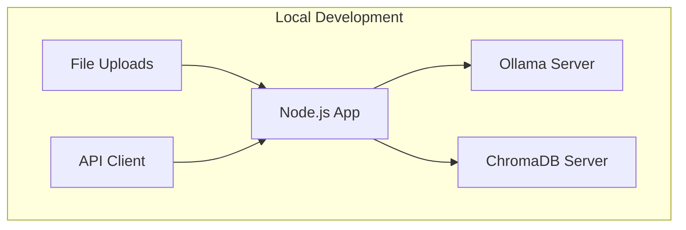

# Technical Documentation - Specialist Agent RAG System

## Table of Contents
1. [System Overview](#system-overview)
2. [Architecture](#architecture)
3. [Tech Stack](#tech-stack)
4. [Database Schema](#database-schema)
5. [API Architecture](#api-architecture)
6. [File Processing Pipeline](#file-processing-pipeline)
7. [Vector Store Architecture](#vector-store-architecture)
8. [Deployment Architecture](#deployment-architecture)
9. [Security Considerations](#security-considerations)
10. [Performance Considerations](#performance-considerations)
11. [Monitoring & Logging](#monitoring--logging)
12. [Development Setup](#development-setup)

---

## System Overview

The Specialist Agent is a Retrieval-Augmented Generation (RAG) system that enables intelligent document processing and question-answering capabilities. The system ingests documents, processes them into vector embeddings, stores them in a vector database, and provides intelligent responses based on document content.

### Key Features
- **Document Processing**: Support for PDF, TXT, MD, DOCX files
- **Vector Search**: Semantic similarity search using embeddings
- **Intelligent Q&A**: Context-aware responses using LLM
- **File Upload API**: Direct file upload and processing
- **Fallback System**: In-memory vector store when ChromaDB unavailable
- **RESTful API**: Complete API for all operations

---

## Architecture

### High-Level Architecture



### Component Architecture



---

## Tech Stack

### Backend Framework
- **Node.js** (v16+): JavaScript runtime
- **Express.js** (v4.18.2): Web framework
- **CommonJS**: Module system

### AI & ML Stack
- **Ollama** (v0.5.0): Local LLM inference
  - **Embedding Model**: `nomic-embed-text`
  - **Chat Model**: `llama3.2:3b`
- **ChromaDB** (v1.8.1): Vector database
- **Custom Vector Store**: Fallback in-memory solution

### Document Processing
- **pdf-parse** (v1.1.1): PDF text extraction
- **mammoth** (v1.6.0): DOCX text extraction
- **Native fs**: TXT and MD file handling

### File Upload & Processing
- **multer** (v11.0.0): File upload middleware
- **uuid** (v9.0.1): Unique identifier generation

### Development & Testing
- **nodemon** (v3.0.2): Development server
- **jest** (v29.7.0): Testing framework
- **eslint** (v8.56.0): Code linting

### Environment & Configuration
- **dotenv** (v16.4.5): Environment variable management
- **cors** (v2.8.5): Cross-origin resource sharing

---

## Database Schema

### ChromaDB Schema

#### Collections
```json
{
  "collection_name": "specialist-agent",
  "metadata": {
    "description": "Specialist Agent Knowledge Base"
  }
}
```

#### Document Structure
```json
{
  "id": "uuid-v4-generated",
  "embedding": [0.1, 0.2, 0.3, ...], // 768-dimensional vector
  "document": "chunked_text_content",
  "metadata": {
    "source": "filename.pdf",
    "title": "document_title",
    "chunk_index": 0,
    "original_doc_index": 0,
    "type": "pdf|txt|md|docx"
  }
}
```

### Simple Vector Store Schema (Fallback)

#### In-Memory Structure
```javascript
{
  documents: [
    {
      id: "uuid",
      content: "text_content",
      embedding: [0.1, 0.2, ...],
      metadata: {
        source: "filename",
        title: "title",
        chunkIndex: 0
      }
    }
  ],
  embeddings: [
    [0.1, 0.2, ...], // Vector arrays
    [0.3, 0.4, ...]
  ]
}
```

#### Persistence Schema (JSON)
```json
{
  "documents": [
    {
      "id": "uuid",
      "content": "text",
      "embedding": [0.1, 0.2],
      "metadata": {}
    }
  ],
  "lastUpdated": "2024-01-01T00:00:00.000Z"
}
```

---

## API Architecture

### RESTful Endpoints

#### Base URL: `http://localhost:3000`

| Method | Endpoint | Purpose | Content-Type |
|--------|----------|---------|--------------|
| GET | `/` | System info | application/json |
| GET | `/api/health` | Health check | application/json |
| POST | `/api/query` | Ask questions | application/json |
| POST | `/api/ingest` | Single file upload | multipart/form-data |
| POST | `/api/ingest` | Directory processing | application/json |
| POST | `/api/ingest/multiple` | Multiple file upload | multipart/form-data |

### Request/Response Patterns

#### Query Request
```json
{
  "question": "What is the main topic?"
}
```

#### Query Response
```json
{
  "answer": "The main topic is...",
  "sources": [
    {
      "source": "document.pdf",
      "title": "Document Title",
      "similarity": 0.95
    }
  ]
}
```

#### File Upload Request
```
Content-Type: multipart/form-data
Field: file (single file) or files (multiple files)
```

#### File Upload Response
```json
{
  "message": "Documents ingested successfully",
  "source": "uploaded file: document.pdf",
  "documentsLoaded": 1,
  "chunksCreated": 5
}
```

---

## File Processing Pipeline

### Document Processing Flow



### Text Chunking Strategy

```javascript
// Chunking Parameters
const CHUNK_SIZE = 1000;        // Characters per chunk
const CHUNK_OVERLAP = 200;      // Overlap between chunks

// Chunking Algorithm
1. Split text into chunks of CHUNK_SIZE
2. Find optimal break points (sentence/paragraph boundaries)
3. Apply CHUNK_OVERLAP between consecutive chunks
4. Filter out empty chunks
5. Add metadata (chunk_index, original_doc_index)
```

### Supported File Types

| Type | Extension | Parser | Max Size | Notes |
|------|-----------|--------|----------|-------|
| PDF | `.pdf` | pdf-parse | 10MB | Text extraction only |
| DOCX | `.docx` | mammoth | 10MB | Raw text extraction |
| Text | `.txt` | fs.readFile | 10MB | UTF-8 encoding |
| Markdown | `.md` | fs.readFile | 10MB | Preserves formatting |

---

## Vector Store Architecture

### ChromaDB Integration

#### Connection Configuration
```javascript
const client = new ChromaClient({
  path: process.env.CHROMA_URL || 'http://localhost:8000'
});
```

#### Collection Management
```javascript
// Collection Creation
await client.createCollection({
  name: 'specialist-agent',
  metadata: { description: 'Specialist Agent Knowledge Base' }
});

// Document Addition
await collection.add({
  ids: [uuid1, uuid2, ...],
  embeddings: [embedding1, embedding2, ...],
  documents: [text1, text2, ...],
  metadatas: [metadata1, metadata2, ...]
});
```

### Fallback Vector Store

#### In-Memory Implementation
```javascript
class SimpleVectorStore {
  constructor() {
    this.documents = [];
    this.embeddings = [];
  }
  
  // Cosine similarity calculation
  cosineSimilarity(a, b) {
    // Implementation details...
  }
  
  // Similarity search
  async similarity_search(query, k = 5) {
    // Search implementation...
  }
}
```

#### Persistence Strategy
- **File-based**: JSON serialization to disk
- **Auto-save**: Periodic persistence
- **Recovery**: Load from disk on startup

---

## Deployment Architecture

### Development Environment



### Production Considerations

#### Service Dependencies
1. **Ollama Service**
   - Model: `nomic-embed-text` (274MB)
   - Model: `llama3.2:3b` (2GB+)
   - Port: 11434 (default)

2. **ChromaDB Service**
   - Port: 8000
   - Data persistence: `./chroma`
   - Memory requirements: Variable

3. **Node.js Application**
   - Port: 3000 (configurable)
   - Memory: ~100MB base + document processing

#### Docker Configuration (Recommended)

```dockerfile
# Dockerfile
FROM node:18-alpine

WORKDIR /app
COPY package*.json ./
RUN npm install

COPY . .
EXPOSE 3000

CMD ["npm", "start"]
```

```yaml
# docker-compose.yml
version: '3.8'
services:
  app:
    build: .
    ports:
      - "3000:3000"
    environment:
      - OLLAMA_BASE_URL=http://ollama:11434
      - CHROMA_URL=http://chromadb:8000
    depends_on:
      - ollama
      - chromadb

  ollama:
    image: ollama/ollama
    ports:
      - "11434:11434"
    volumes:
      - ollama_data:/root/.ollama

  chromadb:
    image: chromadb/chroma
    ports:
      - "8000:8000"
    volumes:
      - chroma_data:/chroma/chroma

volumes:
  ollama_data:
  chroma_data:
```

---

## Security Considerations

### File Upload Security
- **File Type Validation**: Whitelist approach
- **File Size Limits**: 10MB maximum
- **Temporary Storage**: Automatic cleanup
- **Path Traversal Protection**: Secure file handling

### API Security
- **CORS Configuration**: Configurable origins
- **Input Validation**: Request body validation
- **Error Handling**: Sanitized error messages
- **Rate Limiting**: Recommended for production

### Data Privacy
- **Local Processing**: No external API calls
- **Temporary Files**: Automatic cleanup
- **Vector Storage**: Local ChromaDB instance
- **Logging**: No sensitive data in logs

---

## Performance Considerations

### Embedding Generation
- **Batch Processing**: Sequential processing for stability
- **Model Loading**: Ollama model caching
- **Memory Management**: Garbage collection optimization

### Vector Search Performance
- **Index Optimization**: ChromaDB indexing
- **Query Caching**: Similar query caching
- **Batch Operations**: Bulk document insertion

### File Processing
- **Streaming**: Large file processing
- **Memory Limits**: Chunk-based processing
- **Concurrent Processing**: Multiple file handling

### Scalability
- **Horizontal Scaling**: Multiple app instances
- **Load Balancing**: Nginx/HAProxy
- **Database Scaling**: ChromaDB clustering

---

## Monitoring & Logging

### Application Logging
```javascript
// Logging Levels
console.log('Info: Document processed');
console.warn('Warning: File cleanup failed');
console.error('Error: Embedding generation failed');
```

### Health Monitoring
```javascript
// Health Check Endpoint
GET /api/health
{
  "status": "healthy",
  "timestamp": "2024-01-01T00:00:00.000Z",
  "services": {
    "ollama": "connected",
    "chromadb": "connected",
    "vectorstore": "ready"
  }
}
```

### Metrics to Monitor
- **Document Processing Rate**: Documents/minute
- **Query Response Time**: Average response time
- **Memory Usage**: Heap and RSS
- **Vector Store Size**: Document count and storage
- **Error Rates**: Failed requests percentage

---

## Development Setup

### Prerequisites
```bash
# Required Software
Node.js >= 16.0.0
Ollama (latest)
ChromaDB (latest)
Git
```

### Installation Steps
```bash
# 1. Clone Repository
git clone <repository-url>
cd specialist-agent

# 2. Install Dependencies
npm install

# 3. Install Ollama Models
ollama pull nomic-embed-text
ollama pull llama3.2:3b

# 4. Start ChromaDB
chroma run --host localhost --port 8000

# 5. Configure Environment
cp .env.example .env
# Edit .env with your settings

# 6. Start Application
npm start
```

### Environment Variables
```bash
# Ollama Configuration
OLLAMA_BASE_URL=http://localhost:11434
EMBEDDING_MODEL=nomic-embed-text
CHAT_MODEL=llama3.2:3b

# ChromaDB Configuration
CHROMA_URL=http://localhost:8000
COLLECTION_NAME=specialist-agent

# Application Configuration
PORT=3000
NODE_ENV=development
```

### Development Scripts
```json
{
  "scripts": {
    "start": "node src/app.js",
    "dev": "nodemon src/app.js",
    "test": "jest",
    "lint": "eslint src/",
    "lint:fix": "eslint src/ --fix"
  }
}
```

### Testing Strategy
- **Unit Tests**: Individual service testing
- **Integration Tests**: API endpoint testing
- **Load Tests**: Performance testing
- **File Upload Tests**: Document processing testing

---

## Troubleshooting

### Common Issues

#### 1. Ollama Model Not Found
```bash
# Solution: Pull required models
ollama pull nomic-embed-text
ollama pull llama3.2:3b
```

#### 2. ChromaDB Connection Failed
```bash
# Solution: Start ChromaDB server
chroma run --host localhost --port 8000
```

#### 3. Port Already in Use
```bash
# Solution: Kill existing process
lsof -ti:3000 | xargs kill -9
```

#### 4. File Upload Errors
- Check file size (max 10MB)
- Verify file type (PDF, TXT, MD, DOCX)
- Ensure proper multipart/form-data encoding

### Debug Mode
```bash
# Enable debug logging
DEBUG=* npm start

# Or specific modules
DEBUG=app,api,vectorstore npm start
```

---

## Future Enhancements

### Planned Features
1. **Web UI**: Browser-based interface
2. **Authentication**: User management system
3. **Document Management**: CRUD operations
4. **Advanced Search**: Filters and facets
5. **Analytics**: Usage statistics and insights
6. **Multi-language**: Internationalization support

### Technical Improvements
1. **Caching Layer**: Redis integration
2. **Message Queue**: Background processing
3. **Microservices**: Service decomposition
4. **Kubernetes**: Container orchestration
5. **Monitoring**: Prometheus/Grafana integration

---

## Conclusion

This technical documentation provides a comprehensive overview of the Specialist Agent RAG system architecture, implementation details, and operational considerations. The system is designed for scalability, maintainability, and ease of deployment while providing powerful document processing and question-answering capabilities.

For additional support or questions, please refer to the API documentation or create an issue in the project repository.
